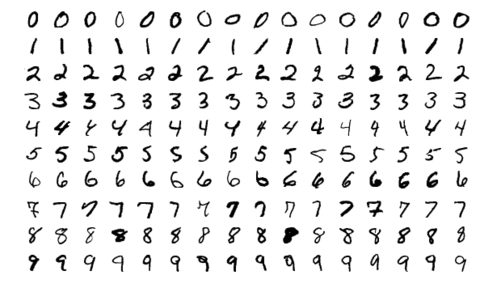
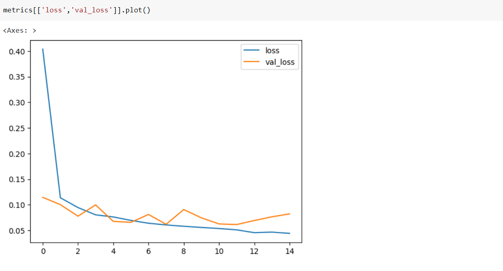
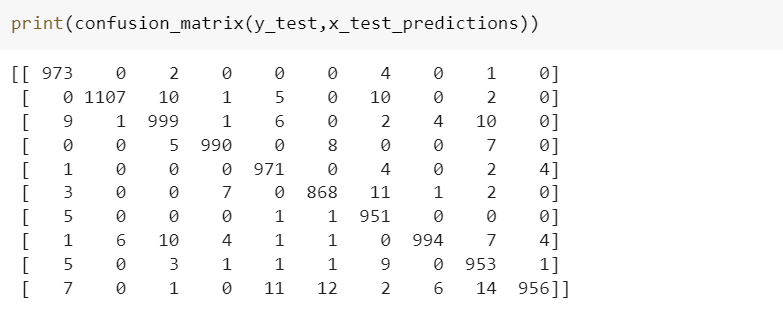
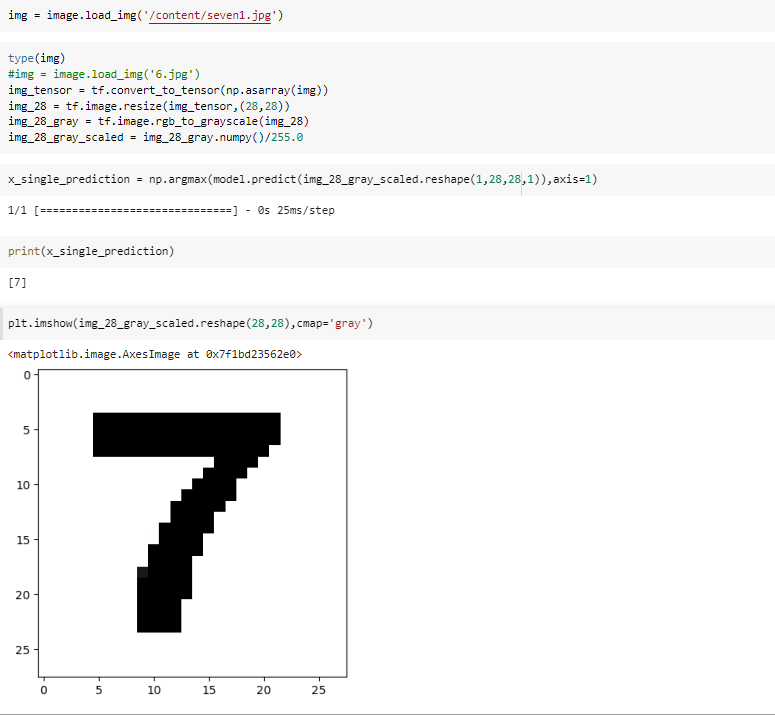

# Convolutional Deep Neural Network for Digit Classification

## AIM

To Develop a convolutional deep neural network for digit classification and to verify the response for scanned handwritten images.

## Problem Statement and Dataset

Digit classification and to verify the response for scanned handwritten images.

The MNIST dataset is a collection of handwritten digits. The task is to classify a given image of a handwritten digit into one of 10 classes representing integer values from 0 to 9, inclusively. The dataset has a collection of 60,000 handwrittend digits of size 28 X 28. Here we build a convolutional neural network model that is able to classify to it's appropriate numerical value.


## Neural Network Model


Flattened input to hidden layer and then output layer 


## DESIGN STEPS

### STEP 1:
Import tensorflow and preprocessing libraries

### STEP 2:
Build a CNN model


### STEP 3:
Compile and fit the model and then predict


## PROGRAM
```
import numpy as np
from tensorflow import keras
from tensorflow.keras import layers
from tensorflow.keras.datasets import mnist
import tensorflow as tf
import matplotlib.pyplot as plt
from tensorflow.keras import utils
import pandas as pd
from sklearn.metrics import classification_report,confusion_matrix
from tensorflow.keras.preprocessing import image
     

(X_train, y_train), (X_test, y_test) = mnist.load_data()
     

X_train.shape
     

X_test.shape
     

single_image= X_train[1520]
     

single_image.shape
     

plt.imshow(single_image,cmap='gray')
     

y_train.shape
     

X_train.min()
     

X_train.max()
     

X_train_scaled = X_train/255.0
X_test_scaled = X_test/255.0
     

X_train_scaled.min()
     

X_train_scaled.max()
     

y_train[10]
     

y_train_onehot = utils.to_categorical(y_train,10)
y_test_onehot = utils.to_categorical(y_test,10)
     

type(y_train_onehot)
     

y_train_onehot.shape
     

single_image = X_train[1560]
plt.imshow(single_image,cmap='gray')
     

y_train_onehot[10]
     

X_train_scaled = X_train_scaled.reshape(-1,28,28,1)
X_test_scaled = X_test_scaled.reshape(-1,28,28,1)
     
model = keras.Sequential()
input =keras.Input(shape=(28,28,1))
model.add(input)
layer1 = layers.Conv2D(filters =32 , kernel_size =(5,5),strides =(1,1),padding ='same')
model.add(layer1)
pool1 = layers.MaxPool2D(pool_size=(2,2))
model.add(pool1)
layer2 = layers.Conv2D(filters =16 , kernel_size =(5,5),strides =(1,1),padding ='same')
model.add(layer2)
layer3 = layers.Flatten()
model.add(layer3)
hidden1 =layers.Dense(units =8, activation='relu')
model.add(hidden1)
output = layers.Dense(units=10,activation='softmax')
model.add(output)
     

model.summary()
     
model.compile(optimizer='adam',
                 loss='categorical_crossentropy',
                 metrics=['accuracy'])

model.fit(X_train_scaled ,y_train_onehot, epochs=15,
          batch_size=64, 
          validation_data=(X_test_scaled,y_test_onehot))
     

metrics = pd.DataFrame(model.history.history)
     

metrics.head()
     

metrics[['accuracy','val_accuracy']].plot()
     

metrics[['loss','val_loss']].plot()
     

x_test_predictions = np.argmax(model.predict(X_test_scaled), axis=1)
     

print(confusion_matrix(y_test,x_test_predictions))
     

print(classification_report(y_test,x_test_predictions))
     
# Prediction for a single input


img = image.load_img('/content/seven1.jpg')     

type(img)
img_tensor = tf.convert_to_tensor(np.asarray(img))
img_28 = tf.image.resize(img_tensor,(28,28))
img_28_gray = tf.image.rgb_to_grayscale(img_28)
img_28_gray_scaled = img_28_gray.numpy()/255.0

     

x_single_prediction = np.argmax(
    model.predict(img_28_gray_scaled.reshape(1,28,28,1)),
     axis=1)
     

print(x_single_prediction)
plt.imshow(img_28_gray_scaled.reshape(28,28),cmap='gray')

```

##  Inverting the image

```
img_28_gray_inverted = 255.0-img_28_gray
img_28_gray_inverted_scaled = img_28_gray_inverted.numpy()/255.0

x_single_prediction = np.argmax(model.predict(img_28_gray_inverted_scaled.reshape(1,28,28,1)),axis=1)

x_single_prediction = np.argmax(model.predict(img_28_gray_inverted_scaled.reshape(1,28,28,1)),axis=1)

     
```
## OUTPUT

### Training Loss, Validation Loss Vs Iteration Plot


### Classification Report


### Confusion Matrix



### New Sample Data Prediction



## RESULT
Thus, a convolutional deep neural network for digit classification and to verify the response for scanned handwritten images is written and executed successfully.
